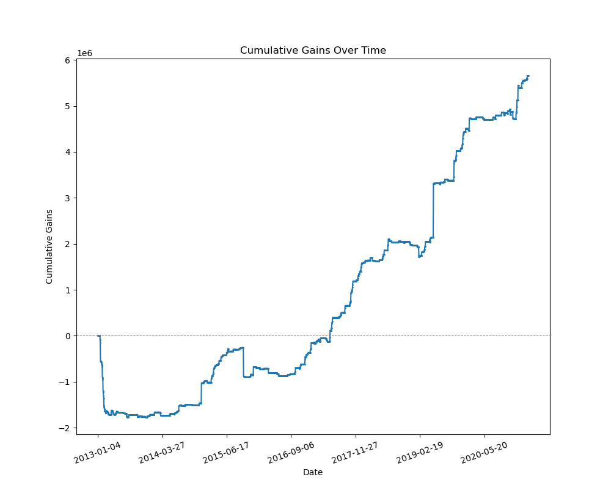

# y_intercept_test

## Workflow

This project follows a structured workflow for generating statistical trading signals and implementing trading strategies. The key steps in the workflow are as follows:

### 1. Preprocessing Data

Check for missing values (NA values) and negative values.

### 2. Generating Statistical Trading Signals

The project uses various statistical trading signal strategies to make trading decisions, where each strategy generates buy and sell signals based on specific conditions:

#### a. Moving Average Crossover Strategy

- Buy when a short-term moving average (5-day) crosses above a long-term moving average (20-day).
- Sell when the short-term moving average crosses below the long-term moving average.

#### b. Bollinger Bands Strategy

- Buy when the price touches or falls below the lower Bollinger Band (20-day, 2-std) and then moves back into the band.
- Sell when the price touches or rises above the upper Bollinger Band and then moves back into the band.

#### c. Relative Strength Index (RSI) Strategy

- Buy when the RSI crosses above an oversold threshold (30), indicating a potential upward move.
- Sell when the RSI crosses below an overbought threshold (70), indicating a potential downward move.

#### d. Moving Average Convergence Divergence (MACD) Strategy

- Buy when the MACD line crosses above the signal line.
- Sell when the MACD line crosses below the signal line.

#### e. Mean Reversion Strategy

- Buy when the stock's price is significantly below its moving average, indicating it might revert to the mean.
- Sell when the stock's price is significantly above its moving average.

#### f. Dual Moving Average Crossover Strategy

- Use two moving averages (10-day and 50-day). Buy when the short-term MA crosses above the long-term MA and sell when it crosses below.

### 3. Trading Strategies

After generating trading signals, we combine (sum) all the trading signals from the different strategies:

- Sum all trading signals generated from the strategies, and filter out signals with an absolute sum less than or equal to 2. Specifically, we follow the trading actions:
- `current_balance` = 0
- `current_position` = 0
  - If `buy_signal > 2`:
    - If `current_position` is 0, buy `abs(buy_signal)` volumes with current price.
    - If `current_position` is greater than 0, buy additional volumes only when `abs(buy_signal)` is stronger.
  - If `sell_signal > 2`:
    - If `current_position` is greater than 0, sell based on the strength of `abs(sell_signal)`.
    - If `current_position` is 0, do nothing (with potential modifications in the future, e.g. borrow stocks to short).

## Results

With the trading strategies and executions described above, the project provides results showing the aggregate gains of the portfolio:

## Future Work

The trading strategies in this project can be further fine-tuned and optimized for better performance. Future work may include adjusting hyperparameters such as window size and threshold values for the trading strategies. It's important to conduct more extensive backtesting and analysis to validate and refine the strategies.

Additional aspects of future work can involve implementing risk management techniques, exploring other trading strategies, and further enhancing the project for real-world trading.
